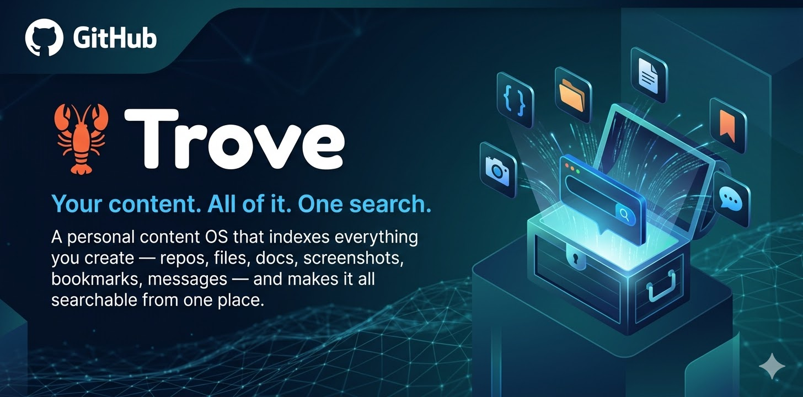

<p align="center">
  
</p>

<h1 align="center">🦞 Trove</h1>

<p align="center">
  <strong>Your content. All of it. One search.</strong><br/>
  A personal content OS that indexes everything you create — repos, files, docs, screenshots, bookmarks, messages — and makes it all searchable from one place.
</p>

<p align="center">
  <a href="https://opensource.org/licenses/MIT"></a>
  <a href="https://nodejs.org"></a>
  <a href="https://github.com/antoinebecker10-afk/trove"></a>
</p>

<p align="center">
  <a href="#quick-start">Quick Start</a> · <a href="#connectors">14 Connectors</a> · <a href="#dashboard">Dashboard</a> · <a href="#mcp-server">MCP for Claude Code</a> · <a href="#write-a-connector">Write a Connector</a>
</p>

---

## The Problem

Your work is everywhere. GitHub repos. Local folders. Notion docs. Figma designs. Slack threads. Screenshots you took 3 days ago. That API doc you bookmarked somewhere.

You spend more time **looking for things** than actually working on them.

## The Solution

Trove indexes everything in one place and lets you search across all of it — semantically, locally, privately.

```bash
npx trove-os init     # setup
npx trove-os index    # index everything
npx trove-os search "that API design doc from last week"
```

No cloud. No subscriptions. Your data stays on your machine.

---

## Two interfaces, one index

Trove has **two faces** built on the same index:

| | For Humans | For AI Agents |
|---|---|---|
| **Interface** | Desktop app, CLI, web dashboard | MCP server (7 tools) |
| **How it works** | Visual search, file browser, source management | Embeddings-powered API queries |
| **Cost** | Free — runs locally | **50-100x fewer tokens** vs. filesystem scanning |
| **Use case** | "Where's that screenshot?" | Agent: `trove_find("terrain screenshot")` → instant result |

The AI side is the game-changer: instead of your agent reading 50+ files to find what it needs (10,000-50,000 tokens), it queries Trove's pre-computed embeddings and gets ranked results in **200-500 tokens**. Same index, fraction of the cost.

---

## Features

**Search everything from one place**
- Semantic search — find by meaning, not just keywords
- Keyword fallback with smart AND/OR matching — always finds something
- AI-powered answers via local Ollama (Mistral for RAG, Qwen3 for chat)

**15 connectors, plug and play**
- Connect Notion, GitHub, Slack, Figma, Discord, OpenClaw, Claude Code, and 8 more
- Each connector is ~100-200 lines of TypeScript. Easy to build, easy to contribute.

**Incremental indexing + live watch**
- Only re-indexes changed files — skips unchanged content based on modification timestamps
- `trove watch` monitors your local sources in real-time and auto-reindexes on changes
- SSE streaming progress in the dashboard

**Desktop app (Electron)**
- `npx trove-os desktop` — one command, full app
- Semantic search with AI answers
- Source management — connect/disconnect services in 1 click
- File browser with dual-pane drag & drop
- Keyboard shortcuts, preview modals, context menus

**MCP server — the AI bridge**
- 7 tools: find, open, locate, search, list-sources, get-content, reindex
- Works with Claude Code, OpenClaw, Cursor, Windsurf, Cline, and any MCP-compatible agent
- Pre-computed embeddings → instant results, minimal tokens
- Ask your agent "find my Figma mockups" — it queries the index, not your filesystem

**Local AI stack — no cloud required**
- **Embeddings**: Ollama (`nomic-embed-text`), Transformers.js (`all-MiniLM-L6-v2`), local TF-IDF, or Anthropic (optional)
- **RAG answers**: Mistral via Ollama — answers grounded in your search results, no hallucination
- **Chat**: Qwen3 via Ollama — multi-turn interactive conversations about your content
- **OCR**: Tesseract.js extracts text from screenshots and images
- **Storage**: JSON or SQLite (with optional `sqlite-vec` vector search) + AES-256-GCM encryption
- Auto-fallback: Ollama unavailable → Transformers.js → local TF-IDF. Always works.
- Everything runs on your machine, zero API keys needed

**Security-first architecture**
- Sensitive files auto-blocked from indexing (`.env`, private keys, wallets, credentials — 40+ patterns)
- Secrets redacted in indexed content (API keys, passwords, credit cards → `[REDACTED]`)
- Optional AES-256-GCM encryption at rest for the index
- Auth token required on every API request
- CORS restricted to localhost, DNS rebinding protection
- No file content sent to external APIs for embeddings
- MCP tools refuse to read sensitive files
- Timing-safe token comparison, security headers, request size limits

---

## Quick Start

```bash
# Interactive setup wizard — connects your sources, installs local AI, runs first index
npx trove-os setup
```

That's it. The wizard walks you through everything:
1. Select sources (Local Files, GitHub, Notion, Discord, Slack, Figma, etc.)
2. Enter API tokens (auto-detects GitHub CLI)
3. Install local AI models via Ollama (no cloud API needed)
4. Generate `.trove.yml` + `.env`
5. Run your first index

Or if you prefer manual setup:

```bash
npx trove-os init            # Scaffold config files
# Edit .trove.yml + .env
npx trove-os index            # Index your content
npx trove-os search "query"   # Search
```

## Use with AI Agents

Trove acts as a **search engine for AI agents** — instead of scanning your entire filesystem (thousands of tokens), agents query Trove's index and get instant results (10-50 tokens). This dramatically reduces token usage and response time.

### Claude Code (MCP)

```bash
claude mcp add trove -- npx trove-os mcp
```

Then ask Claude:

> "Find my terrain screenshots from last week"

> "What repos do I have about multiplayer?"

> "Where's that BPMN diagram?"

### OpenClaw

Trove ships with a ready-to-use [SKILL.md](SKILL.md) for [OpenClaw](https://github.com/openclaw/openclaw). One command to install:

```bash
# Copy the skill to your OpenClaw skills directory
cp -r . ~/.openclaw/skills/trove

# Or install via MCP config
openclaw config set mcpServers.trove.command "npx"
openclaw config set mcpServers.trove.args '["trove-os", "mcp"]'
```

OpenClaw gets access to all 7 Trove tools. Ask it:

> "Find my Figma mockups for the landing page"

> "What did I post on Discord about Rust ECS?"

### Any MCP-compatible agent

Trove's MCP server works with **any agent that supports Model Context Protocol** — OpenClaw, Claude Code, Cursor, Windsurf, Cline, and more. One server, every agent.

```bash
npx trove-os mcp   # Start MCP server (stdio)
```

### Token savings

| Without Trove | With Trove | Savings |
|---------------|------------|---------|
| Agent scans filesystem (read 50+ files) | `trove_locate` → 5 paths | **~95% fewer tokens** |
| Agent reads file contents to find matches | `trove_find` → relevant content only | **~90% fewer tokens** |
| Agent lists directories recursively | `trove_search` → ranked results | **~98% fewer tokens** |
| 10,000-50,000 tokens per file search | 200-500 tokens per Trove query | **50-100x reduction** |

---

## Connectors

### Connected (setup wizard + backend ready)

| Connector | Source | What it indexes |
|-----------|--------|----------------|
| 📁 **Local Files** | Your computer | Files, images, videos, documents, code |
| ⬡ **GitHub** | GitHub API | Repos, READMEs, metadata, topics |
| 📝 **Notion** | Notion API | Pages, databases, blocks as Markdown, properties |
| 💎 **Obsidian** | Local vault | Notes, frontmatter, wiki-links, #tags |
| 🎨 **Figma** | Figma API | Files, components, pages |
| 💬 **Slack** | Slack API | Messages, bookmarks, starred items, threads |
| 📊 **Google Drive** | Google API | Docs, Sheets, Slides, Drive files |
| 📐 **Linear** | GraphQL API | Issues, documents, projects |
| 🎮 **Discord** | Discord API | Messages, pins, server content |
| 📋 **Airtable** | Airtable API | Bases, tables, records |
| 📦 **Dropbox** | Dropbox API | Files, folders, text content |
| 📘 **Confluence** | Atlassian API | Spaces, pages, blog posts |
| 💧 **Raindrop.io** | Raindrop API | Bookmarks, collections, highlights |
| 🤖 **OpenClaw** | REST API + local files | Conversations, memories, skills |
| 🧠 **Claude Code** | Local files (~/.claude) | Conversations, project memories, session transcripts |

> All connectors use **raw fetch** — zero external SDK dependencies. Each one is a single TypeScript file with rate limiting, pagination, and abort support.

### Coming Soon

🟣 Gamma · 🎯 Canva · 📄 Google Docs · 🎬 YouTube · 🔶 Reddit · 🐦 Twitter/X · 🌐 Browser Bookmarks · 🔷 Jira

Want to build one? It's ~100 lines of TypeScript. See [Write a Connector](#write-a-connector).

---

## Dashboard

The web dashboard runs locally and gives you a visual interface to your content.

### File Manager
Dual-pane file manager with drag & drop between panes. Grid/list toggle, breadcrumb navigation, context menus, keyboard shortcuts (Del, F2, Ctrl+C, Enter). Favorites sidebar with quick access folders.

### Launcher
Masonry grid of all indexed items. Images display as thumbnails. Infinite scroll, type filters with count badges, integrated search with debounce.

### Search
Semantic search powered by local embeddings. AI-powered answers via Ollama. Filter by type (files, images, repos, docs, videos) and by source (Local, GitHub, Notion, Obsidian, Slack, Figma).

### Sources
Connect and disconnect services from the dashboard. Setup wizards for each connector — paste your token, configure options, click Connect. No YAML editing needed.

---

## Configuration

`.trove.yml` — sources and settings:

```yaml
storage: sqlite      # or "json" (legacy)
data_dir: ~/.trove
embeddings: ollama   # "ollama" (recommended), "transformers" (local), "local" (TF-IDF), "anthropic" (cloud)

sources:
  - connector: local
    config:
      paths: [~/Desktop, ~/Documents]
      extensions: [".md", ".ts", ".rs", ".png", ".mp4", ".pdf"]
      ignore: ["node_modules", ".git", "dist"]

  - connector: github
    config:
      username: your-username

  - connector: notion
    config:
      # leave empty to index entire workspace
      exclude_title_patterns: ["Draft:", "Template:"]

  - connector: obsidian
    config:
      vault_path: ~/Documents/MyVault

  - connector: slack
    config:
      since_days: 30
```

API tokens go in `.env` (never in config, never committed — `.env` is gitignored):
```bash
# Required for semantic search (optional: local TF-IDF works without it)
ANTHROPIC_API_KEY=sk-ant-...          # https://console.anthropic.com/settings/keys

# Connectors — add only the ones you use
GITHUB_TOKEN=ghp_...                  # https://github.com/settings/tokens
NOTION_TOKEN=secret_...               # https://www.notion.so/my-integrations
FIGMA_TOKEN=figd_...                  # https://www.figma.com/developers/api#access-tokens
SLACK_TOKEN=xoxb-...                  # https://api.slack.com/apps → OAuth & Permissions
LINEAR_TOKEN=lin_api_...              # https://linear.app/settings/api
DISCORD_TOKEN=...                     # https://discord.com/developers/applications
AIRTABLE_TOKEN=pat...                 # https://airtable.com/create/tokens
DROPBOX_TOKEN=...                     # https://www.dropbox.com/developers/apps
CONFLUENCE_TOKEN=...                  # https://id.atlassian.com/manage-profile/security/api-tokens
CONFLUENCE_EMAIL=you@company.com
RAINDROP_TOKEN=...                    # https://app.raindrop.io/settings/integrations
```

> **Tip:** After cloning, copy `.env.example` to `.env` and fill in your tokens. The `.env` file is gitignored and will never be committed.

### Ollama Embeddings (recommended — free, local, no API key)

```bash
# 1. Install Ollama: https://ollama.com
# 2. Pull an embedding model
ollama pull nomic-embed-text

# 3. Set in .trove.yml
embeddings: ollama

# Optional .env overrides (defaults shown)
OLLAMA_URL=http://localhost:11434
OLLAMA_EMBED_MODEL=nomic-embed-text
OLLAMA_EMBED_DIMENSIONS=768
```

### Security Options

```bash
# Encrypt the index at rest (AES-256-GCM)
TROVE_ENCRYPTION_KEY=your-secret-passphrase

# Set a fixed API token for the web dashboard (auto-generated if omitted)
TROVE_API_TOKEN=your-dashboard-token
```

---

## CLI Commands

```bash
trove-os setup              # Interactive setup wizard (recommended for first use)
trove-os init               # Scaffold config files (non-interactive)
trove-os index [source]     # Index all or specific source
trove-os search <query>     # Semantic search from terminal
trove-os ask <question>     # AI-powered file finder (Ollama or Claude)
trove-os chat               # Interactive AI session
trove-os status             # Show index statistics
trove-os watch              # Live re-index on file changes
trove-os mcp                # Start MCP server (stdio)
```

---

## Security

Trove takes security seriously. Your index may contain paths to bank statements, ID scans, crypto wallets, and passwords. Here's how Trove protects you:

### What's blocked from indexing
Files matching 40+ sensitive patterns are **never indexed**:
- `.env`, `.env.local`, `.env.production` — environment secrets
- `.pem`, `.key`, `.p12`, `.pfx` — private keys and certificates
- `.wallet`, `wallet.dat`, `seed.txt` — crypto wallets
- `.kdbx` — password manager databases
- `id_rsa`, `id_ed25519` — SSH keys
- `credentials.json`, `secrets.json`, `master.key` — application secrets
- Any file with `password`, `secret`, `mnemonic`, `private_key` in the name

### Secret redaction
Even in allowed files (`.js`, `.py`, `.md`...), Trove scans content and redacts:
- API keys (AWS, GitHub, Stripe, OpenAI, Anthropic, Slack, Notion, Figma, 15+ formats)
- Private keys (PEM format)
- Database connection strings
- Passwords in config files
- Credit card numbers, SSNs, JWTs
- Crypto seed phrases

Redacted content appears as `[REDACTED:api_key]` in the index. Originals are never stored.

### Encryption at rest
Set `TROVE_ENCRYPTION_KEY` in `.env` to encrypt the entire index with AES-256-GCM (PBKDF2 key derivation, 100K iterations). Without the key, `~/.trove/index.json` is unreadable binary.

### API security
- Auth token required on every request (auto-generated per session or set via `TROVE_API_TOKEN`)
- CORS restricted to localhost only
- DNS rebinding protection via Host header validation
- Server binds to `127.0.0.1` only (not accessible from network)
- Timing-safe token comparison
- Request body size limit (1 MB)
- Security headers: `X-Content-Type-Options`, `X-Frame-Options`, `Referrer-Policy`
- No shell commands — `execFile()` only, no injection possible

### MCP safety
- MCP tools refuse to read sensitive files (`.env`, `.pem`, `.key`, `.wallet`...)
- All MCP responses include `_security` markers warning the LLM that content is untrusted
- Path re-validation before every file read (prevents index poisoning)
- File content never sent to external embedding APIs — only titles, descriptions, and tags

### Prompt injection defense
- System prompt instructs LLMs to treat indexed content as data, not instructions
- Untrusted content wrapped in clear delimiters
- All MCP tool responses flagged as untrusted

---

## Architecture

```
Sources            Connectors             Engine            Interfaces
────────          ────────────           ────────          ──────────
Local FS    ──→  connector-local    ──→                ──→  CLI
GitHub      ──→  connector-github   ──→                ──→  Web Dashboard
Notion      ──→  connector-notion   ──→   TroveEngine  ──→  MCP Server
Obsidian    ──→  connector-obsidian ──→   (index +     ──→  HTTP API
Figma       ──→  connector-figma    ──→    search +
Slack       ──→  connector-slack    ──→    embeddings)
+8 more     ──→  ...                ──→
```

TypeScript monorepo (pnpm + Turborepo), 18 packages:

| Package | Description |
|---------|-------------|
| `trove-os` | CLI (`npx trove-os`) |
| `@trove/core` | Engine, indexer, JSON/SQLite store, embeddings (4 providers), watcher, secret redaction, encryption |
| `@trove/shared` | Types, Zod schemas, interfaces |
| `@trove/mcp` | MCP server (7 tools for Claude Code) |
| `@trove/web` | Web dashboard (React) + API server |
| `@trove/connector-local` | Local filesystem |
| `@trove/connector-github` | GitHub repos + README |
| `@trove/connector-notion` | Notion pages + databases |
| `@trove/connector-obsidian` | Obsidian vaults |
| `@trove/connector-figma` | Figma files + components |
| `@trove/connector-slack` | Slack messages + bookmarks |
| `@trove/connector-google-drive` | Google Drive files |
| `@trove/connector-linear` | Linear issues + docs |
| `@trove/connector-discord` | Discord messages + pins |
| `@trove/connector-airtable` | Airtable records |
| `@trove/connector-dropbox` | Dropbox files |
| `@trove/connector-confluence` | Confluence pages |
| `@trove/connector-raindrop` | Raindrop.io bookmarks |

---

## Write a Connector

A connector is a single TypeScript file that implements the `Connector` interface:

```typescript
import { z } from "zod";
import type { Connector, ContentItem, IndexOptions } from "@trove/shared";

const connector: Connector = {
  manifest: {
    name: "my-source",
    version: "0.1.0",
    description: "Index content from my source",
    configSchema: z.object({
      token_env: z.string().default("MY_TOKEN"),
    }),
  },

  async validate(config) {
    const parsed = MyConfigSchema.safeParse(config);
    if (!parsed.success) return { valid: false, errors: ["Invalid config"] };
    if (!process.env[parsed.data.token_env]) return { valid: false, errors: ["Token not set"] };
    return { valid: true };
  },

  async *index(config, options) {
    // Fetch data from your API, yield ContentItem objects
    yield {
      id: "my-source:unique-id",
      source: "my-source",
      type: "document",
      title: "My Document",
      description: "A document from my source",
      tags: ["tag1", "tag2"],
      uri: "https://example.com/doc",
      metadata: { /* anything */ },
      indexedAt: new Date().toISOString(),
      content: "Full text content for search...",
    };
  },
};

export default connector;
```

Publish as `@trove/connector-{name}` or `trove-connector-{name}` on npm. Trove auto-discovers them.

See existing connectors in `packages/connectors/` for real examples.

---

## Contributing

We welcome contributions. The easiest way to start is writing a connector — pick one from the [Coming Soon](#coming-soon) list or build your own.

See [CONTRIBUTING.md](CONTRIBUTING.md) for setup and guidelines.

## Built with AI

Trove is built collaboratively with [Claude Code](https://claude.ai/claude-code) — not generated and dumped, but iteratively designed, reviewed, debugged, and refined through hundreds of human+AI pairing sessions. Every architectural decision, security review, and UX choice went through a human. AI accelerated the work; it didn't replace the thinking.

We believe this is how software will increasingly be built — and we think you should know how yours was made.

## AI Integration

Trove is designed to be discovered and used by AI systems:

- **[CLAUDE.md](CLAUDE.md)** — Project context for Claude Code
- **[llms.txt](llms.txt)** — Quick reference for AI crawlers
- **[llms-full.txt](llms-full.txt)** — Complete architecture reference
- **MCP server** — `claude mcp add trove -- npx trove-os mcp`

## License

[MIT](LICENSE)
